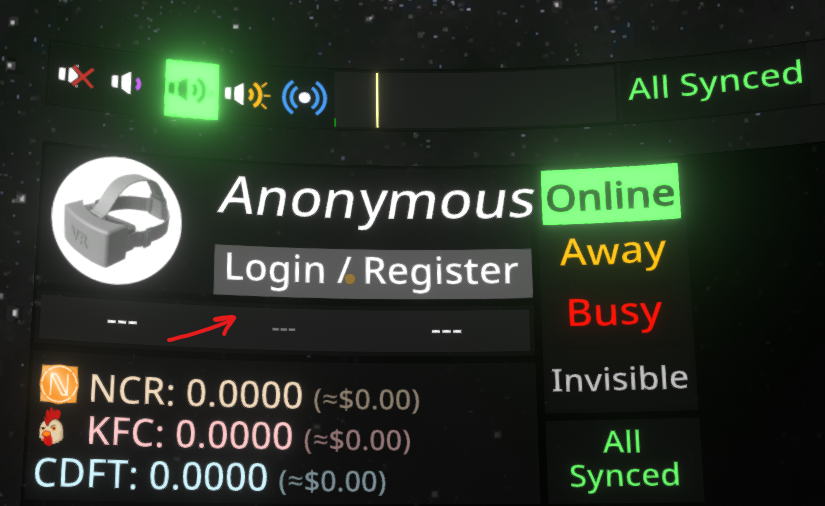
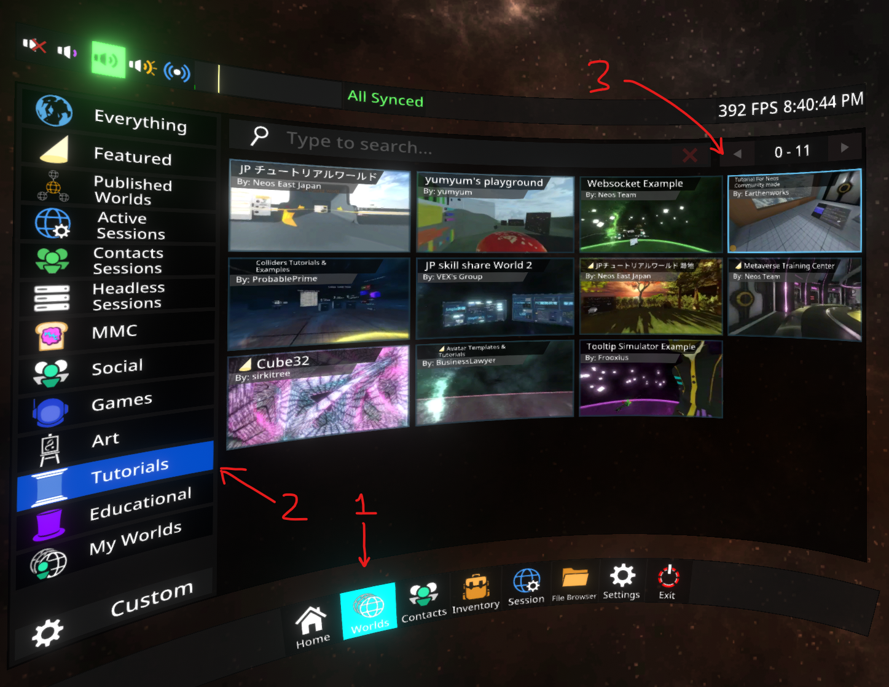
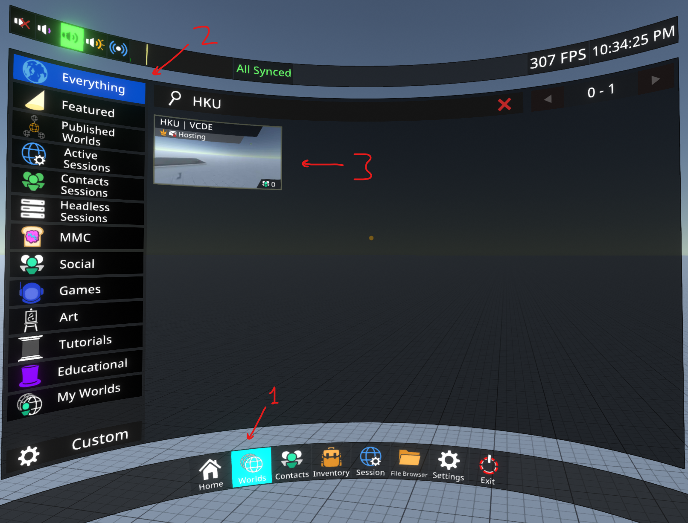
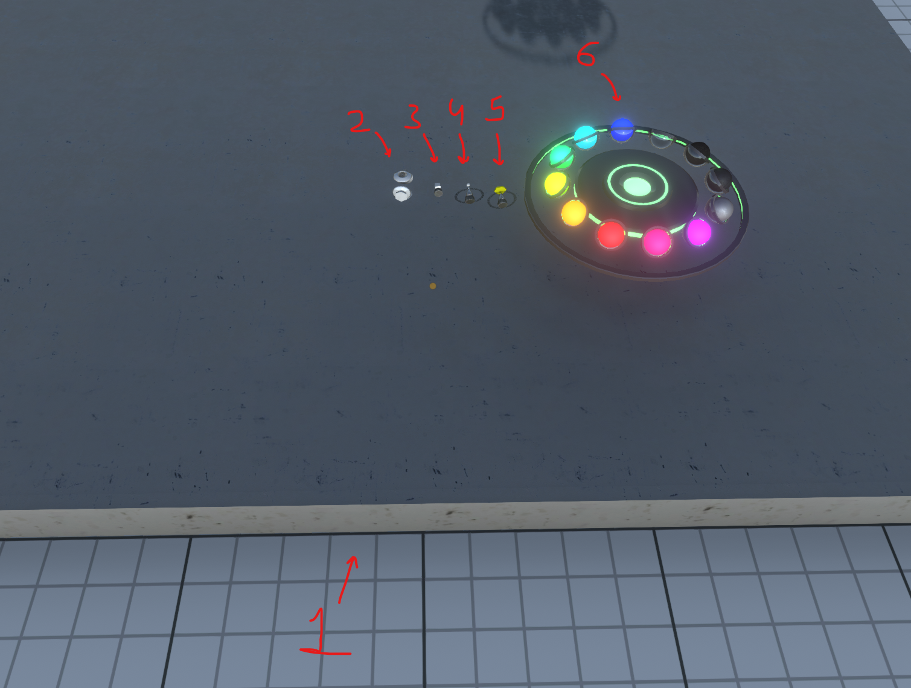
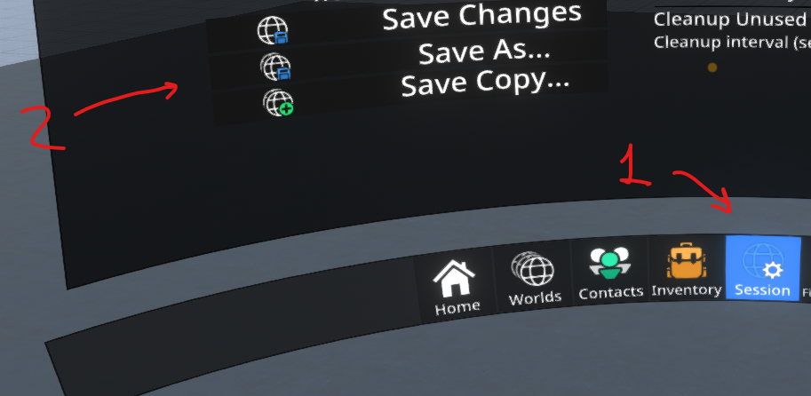

# HKU | Virtual Collaborative Design Environment Workflow Guide

By Steven Jaspersen and Gijs Nikkels

2020-11-11

## Introduction

In these trying times collaborative design is harder than ever. Not being able to see your peers face-to-face and to be unable to interact directly with each other is a burden on any design process. We try to alleviate this burden by providing a virtual platform to collaborate in during your design process using a protocol for your team's workflow. You should use this workflow after a brainstorm session in your design process to make a concrete concept of the ideas brought forward from the brainstorm session.

*This guide was written in English to accommodate international exchange students.*

## Prerequisites

There are a few requirements to start using this workflow in your team:

* [NeosVR](https://store.steampowered.com/app/740250/Neos_VR/), the platform the workflow is based upon.
* It is highly recommended to use a virtual reality headset with two motion tracked controllers
  * It is possible to use any device capable of running games with a mouse and keyboard in NeosVR, but this will hurt your design experience.
* A registered [NeosVR account](https://account.neosvr.com/) with a verified email.
* An idea from the brainstorm session to work on.

## Workflow

### Getting started

* Start NeosVR through Steam using your preferred device.
* Log into your NeosVR account in the home menu, which you can open using the secondary button on your controller or `Ctrl+Space` without VR.

  
* (Optional) This would be a good time to familiarize yourself with NeosVR, you can do so by browsing the "Worlds" section in the main menu, then going to the "Tutorials" section and opening "Tutorial For Neos Community made" by Earthenworks.

  

### Setting up the environment

* To load the virtual collaborative design environment go to the Worlds section in the main menu, then go to the "Everything" world section and search for "HKU". Eventually "HKU | VCDE" by Mutoh should pop up, open that world.

  
* The world contains 6 key elements:

  1. The building platform as an indication for your personal building space.
  
  2. The material tip, which can be used to change the material of any object.
  
  3. The shape tip, which can be used to create primitive 3D shapes.
  
  4. The geometry line brush tip, which can be used to draw thin 3D lines.
  
  5. A thicker geometry line brush tip.
  
  6. A color palette, which can be used to dip your brush in for different colors or to quickly swap out the material in your material tip.

  

* Duplicate these elements for each of your peers with a decent distance between each personal building platform. Now your environment is ready.

### Start building

* Now that your environment is set up make sure everyone is able to start building their concept on their personal building platform.
* Start a timer for 10 minutes to create your concept.
  * If this concept is meant to be a VR experience make sure your peers are able to experience your concept as closely as possible to the final product that you have in mind.
  * The result should be as interactive as possible.
* When the timer stopped and everyone is ready make sure you save the world to your inventory by going to the "Session" section in the main menu and clicking "Save As...".

 

### Presenting and reviewing

* Every team member should now move to the first building platform.
* The team member who built his or her concept at this location should present their idea to the rest of the team explaining each element of the build. This should not take longer than 5 minutes.
* After the presentation each team member is able to experience the interactive elements of the concept.
* Then if there is any feedback, suggestions or possible modifications these should be worked out on the same building platform.
* Repeat this process for every building platform in the world.
* Now you should save a copy of the world using the "Save Copy..." option in the Session section of the main menu.

Now every team member should have a better understanding of the concepts that were created during the brainstorm session, this will help you with choosing the best option for your project.

## Further reading

* [ProbablePrime](https://www.youtube.com/c/ProbablePrime) who has a brilliant YouTube channel containing detailed guides on everything NeosVR has to offer.
* [Frooxius](https://www.youtube.com/user/Tailscpp) the YouTube channel of the creator of NeosVR showcasing many applications for NeosVR.
* [NeosVR wiki](https://wiki.neos.com/Tutorials) containing lots of tutorials and resources.
